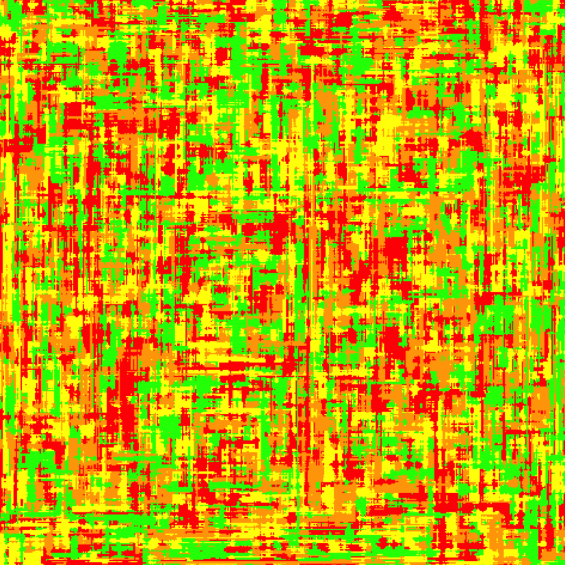
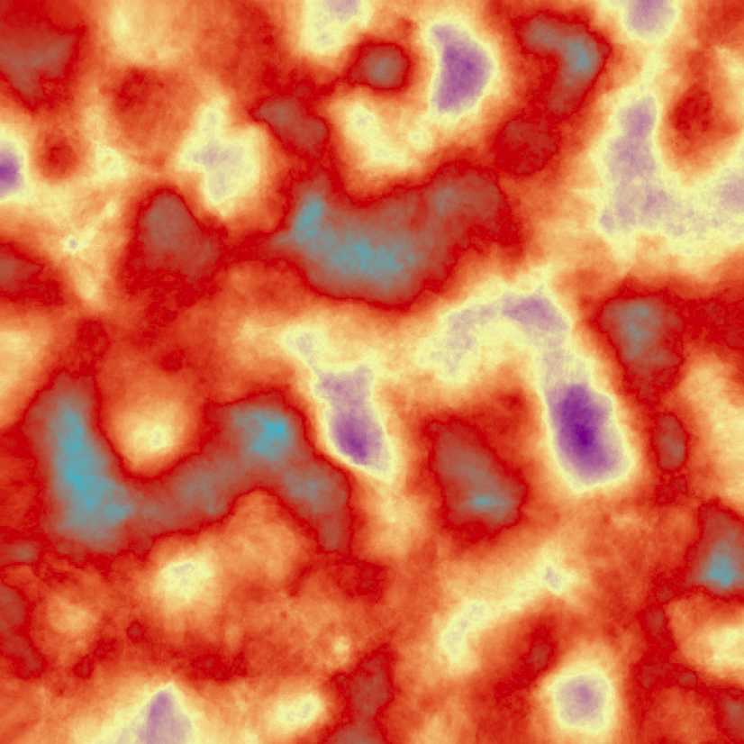
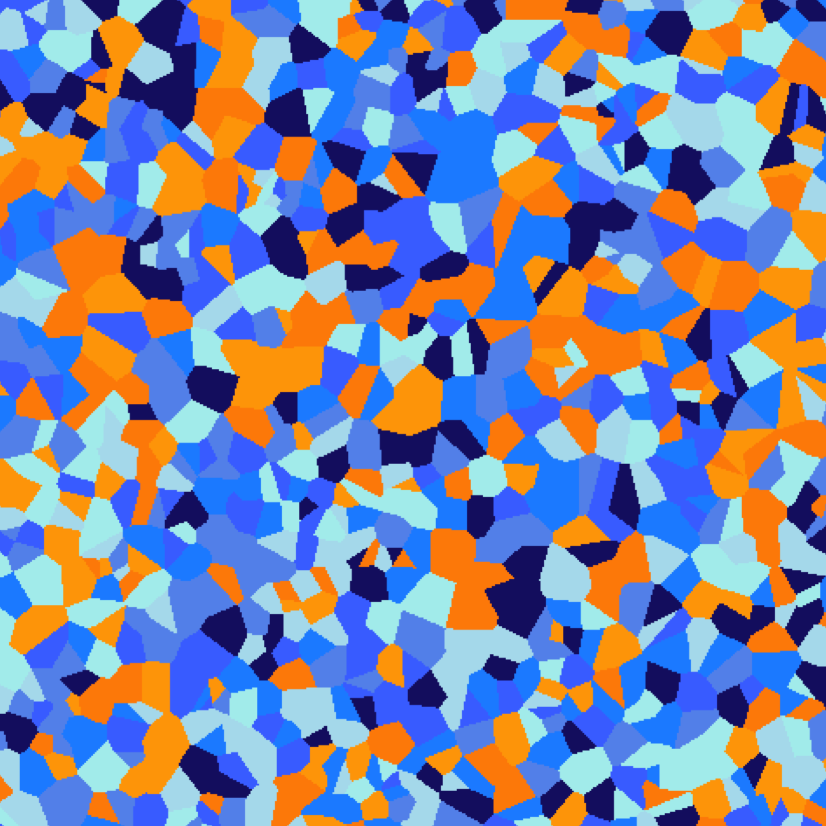

```{r setup, include=FALSE}
knitr::opts_chunk$set(echo = FALSE)
```
Figure 1: Neon Lights (Generative Art Piece #1)



Figure 2: Lava Sky (Generative Art Piece #2)



Figure 3: Bucknell Mosaic (Generative Art Piece #3)



